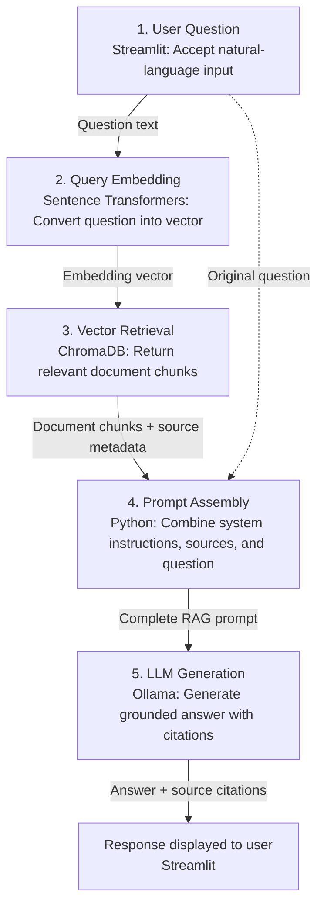

```mermaid
flowchart TD
A["1. User Question<br/>Streamlit: Accept natural-language input"]
B["2. Query Embedding<br/>Sentence Transformers: Convert question into vector"]
C["3. Vector Retrieval<br/>ChromaDB: Return relevant document chunks"]
D["4. Prompt Assembly<br/>Python: Combine system instructions, sources, and question"]
E["5. LLM Generation<br/>Ollama: Generate grounded answer with citations"]
F["Response displayed to user<br/>Streamlit"]

    A -->|"Question text"| B
    B -->|"Embedding vector"| C
    C -->|"Document chunks + source metadata"| D
    A -.->|"Original question"| D
    D -->|"Complete RAG prompt"| E
    E -->|"Answer + source citations"| F
```
